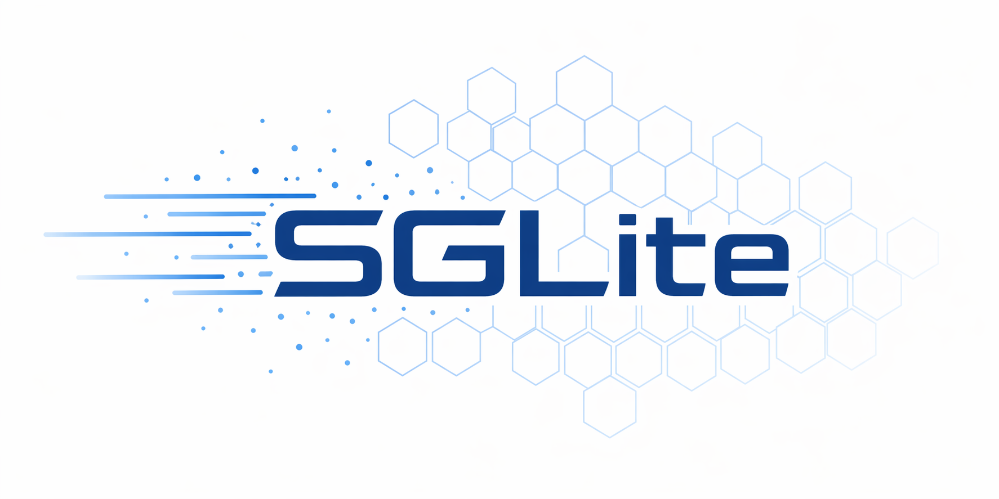

<p align="center">
  
</p>

# SGLite

SGLite is a compact LLM inference runtime inspired by [SGLang](https://github.com/sgl-project/sglang) and [nano-vllm](https://github.com/GeeeekExplorer/nano-vllm). The repository focuses on keeping the serving stack readable while still exposing the core pieces needed for practical GPU inference.

> **Status**: SGLite is still under active testing. Interfaces, flags, and runtime behavior may change. Benchmark numbers are intentionally not published in this README until validation is complete.

## What The Current Codebase Includes

- OpenAI-compatible HTTP serving with `/v1/chat/completions`, `/v1/models`, and `/generate`
- Interactive terminal mode with `python -m sglite --cli`
- Offline in-process generation through `sglite.llm.LLM`
- Tensor parallel serving with `--tp-size`
- Paged KV cache with `radix` and `naive` cache strategies
- Chunked prefill and overlap scheduling
- Attention backends for FlashAttention, FlashInfer, and TensorRT-LLM
- Model loading from local paths, Hugging Face, or ModelScope
- AWQ quantized model support, including Marlin-kernel execution for compatible checkpoints

## Supported Model Families

The current registry in `python/sglite/srt/model_executor/models` supports these architecture families:

- Llama
- Qwen2 / Qwen2.5
- Qwen3 / Qwen3 MoE
- Mistral / Mistral 3

AWQ-quantized variants of supported model families are also supported. SGLite detects AWQ checkpoints from Hugging Face config metadata or local quantization config files, automatically uses the Marlin kernel for compatible checkpoints, and falls back to the Triton AWQ path when Marlin requirements are not satisfied. AWQ Marlin requires `SM80+` GPUs.

## Future Plan Roadmap

Planned or possible future work:

### Model Support

- [ ] More Models: additional model architectures, including Qwen3.6

### Advanced Features

- [ ] DP-Attention: add data-parallel attention for memory-efficient MoE/MLA-style serving, reducing duplicated KV cache and improving batch capacity; see [SGLang DPA guide](https://sgl-project.github.io/advanced_features/dp_dpa_smg_guide.html) and [vLLM data parallel deployment](https://docs.vllm.ai/en/stable/serving/data_parallel_deployment.html)
- [ ] More Quantization Methods: add GPTQ ([paper](https://arxiv.org/abs/2210.17323)) and SmoothQuant ([paper](https://arxiv.org/abs/2211.10438)) support with explicit calibration, config loading, and kernel selection paths
- [ ] Speculative Decoding: add draft-model based token proposal and target-model verification to reduce decode latency while preserving the target model's output distribution; see [Fast Inference from Transformers via Speculative Decoding](https://arxiv.org/abs/2211.17192)

## Platform Support

SGLite currently targets **Linux only** on NVIDIA GPUs. The project depends on CUDA-based kernels and Linux-specific runtime assumptions, so native Windows and macOS are not supported.

- Recommended Python version: `3.10+`
- Recommended environment manager: `uv`
- Required runtime: NVIDIA driver + CUDA Toolkit compatible with your machine

## Quick Start

### 1. Create an Environment

```bash
uv venv --python=3.12
source .venv/bin/activate
```

### 2. Install from Source

```bash
git clone https://github.com/D1376/SGLite.git
cd SGLite
uv pip install -e .
```

### 3. Start the Server

```bash
# Single GPU
python -m sglite --model "Qwen/Qwen3-0.6B"

# Multi-GPU tensor parallel serving
python -m sglite --model "meta-llama/Llama-3.1-70B-Instruct" --tp-size 4 --port 30000
```

By default the server listens on `127.0.0.1:1376`.

### 4. Call the OpenAI-Compatible API

```bash
curl http://127.0.0.1:1376/v1/chat/completions \
  -H "Content-Type: application/json" \
  -d '{
    "model": "Qwen/Qwen3-0.6B",
    "messages": [
      {"role": "user", "content": "Write a one-sentence introduction to SGLite."}
    ],
    "max_tokens": 64,
    "temperature": 0.7
  }'
```

### 5. Use Interactive CLI Mode

```bash
python -m sglite --model "Qwen/Qwen3-4B-AWQ" --cli
```

The demo below shows `Qwen3-4B-AWQ` running on a single RTX 5090:


CLI mode supports:

- `/clear` to reset conversation history
- `/quit` to exit

### 6. Use the Offline Python API

```python
from sglite.llm import LLM
from sglite.sampling_params import SamplingParams

llm = LLM(model_path="Qwen/Qwen3-0.6B")
outputs = llm.generate(
    ["Explain chunked prefill in one sentence."],
    SamplingParams(max_tokens=64, temperature=0.7),
)

print(outputs[0]["text"])
```

## Common Options

- `--tp-size`: tensor parallel size
- `--dtype`: `auto`, `float16`, `bfloat16`, `float32`
- `--cache-type`: choose the KV cache strategy
- `--attn-backend`: choose attention backend(s)
- `--model-source modelscope`: pull models from ModelScope instead of Hugging Face

## Repository Guide

- [docs/feats.md](./docs/feats.md): implementation-grounded feature reference
- [docs/arch.md](./docs/arch.md): runtime topology and package layout
- `tests/`: current automated tests for core runtime, environment handling, and kernels
- `benchmark/`: experimental benchmark scripts; results are still being validated

## Acknowledgments

SGLite builds on ideas from several excellent open-source LLM serving projects:

- [SGLang](https://github.com/sgl-project/sglang): for the original inspiration and many of the serving/runtime design ideas behind this project.
- [vLLM](https://github.com/vllm-project/vllm): for advancing practical LLM inference techniques such as PagedAttention, continuous batching, and high-throughput scheduling.
- [nano-vllm](https://github.com/GeeeekExplorer/nano-vllm): for showing how vLLM-style serving concepts can be implemented in a compact and readable codebase.